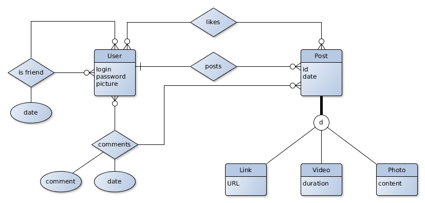

# ESI Exercises

This repository contains the code base for the exercises of the ESI subject
inside the DGSS itinerary.

## Deployment Environment

The environment is based on Maven 3, MySQL 5.5, WildFly 8.2.1 and Eclipse Mars
for JEE.

### Java JDK 8
Download and install Java JDK 8, preferably the Oracle version (the commands
`java` and `javac` must be available).

### Maven
Install Maven 3 in your system, if it was not installed (the `mvn` command must
be available)

### Git
First, install git in your system if it was not installed (the `git` command
must be available). We will work with Git to get updates of these exercises,
as well as to deliver the student solution. Concretely, we will work with 2 Git
repositories inside the [our Gitlab server](http://sing.ei.uvigo.es/dt/gitlab)

1. The main repository (read-only for students)

    Git url: `http://sing.ei.uvigo.es/dt/gitlab/dgss/esi-exercises.git`

2. The student's solution repository. Surf to
[our Gitlab server](http://sing.ei.uvigo.es/dt/gitlab) and create a user with
your @esei.ei.uvigo.es email account. If your username is `bob`, create
a **PRIVATE** project `bob-esi-solutions`

    Git url: `http://sing.ei.uvigo.es/dt/gitlab/bob/bob-esi-solutions.git`

### MySQL
Download and install MySQL 5.5 locally.

Connect to the MySQL client console as root.

    mysql -u root -p

Inside the MySQL console, create the database `dgss`

    create database dgss;

Create the MySQL user `dgssuser` with password `dgsspass` and grant him all
privileges on the `dgss` database

    grant all privileges on dgss.* to dgssuser@localhost identified by "dgsspass";

Exit the MySQL console
    exit

### WildFly
Download
[WildFly 8.2.1.Final](http://download.jboss.org/wildfly/8.2.1.Final/wildfly-8.2.1.Final.zip)

Uncompress the downloaded zip in any folder on your computer.

#### Configure the MySQL driver and the dgss datasource in WildFly
Download [mysql driver 5.1.21](http://central.maven.org/maven2/mysql/mysql-connector-java/5.1.21/mysql-connector-java-5.1.21.jar)
and copy it inside the `standalone/deployments` folder of widlfly

Create the mysql-ds.xml file with the following content and place it inside
the `standalone/deployments` folder of widlfly

```xml
<datasources xmlns:xsi="http://www.w3.org/2001/XMLSchema-instance"
  xmlns="http://www.ironjacamar.org/doc/schema"
  xsi:schemaLocation="http://www.ironjacamar.org/doc/schema http://www.ironjacamar.org/doc/schema/datasources_1_1.xsd">

  <datasource jndi-name="datasource/dgss" pool-name="MySQLPool">

      <connection-url>jdbc:mysql://localhost:3306/dgss</connection-url>
      <driver>mysql-connector-java-5.1.21.jar</driver>
      <pool>
          <max-pool-size>30</max-pool-size>
      </pool>
      <security>
          <user-name>dgssuser</user-name>
          <password>dgsspass</password>
      </security>
  </datasource>
</datasources>
```

#### Start WildFly
Run the following command

    /path/to/wildfly/bin/standalone.sh

Check if WildFly is running by browsing to [http://localhost:8080](http://localhost:8080)

## Developing Environment
### Clone the remote repository  
    git clone http://sing.ei.uvigo.es/dt/gitlab/dgss/esi-exercises.git
    cd esi-exercises

### Prepare for pushing into your own repository
**WARNING: be careful to replace "bob" with your username**

    git remote set-url origin http://sing.ei.uvigo.es/dt/gitlab/bob/bob-esi-solutions.git

### Add the original repository (esi-exercises) as a remote in order to retrieve updates

    git remote add exercises http://sing.ei.uvigo.es/dt/gitlab/dgss/esi-exercises.git

### Start coding your solution
Create a branch for your solution:

    git checkout -b solution

### Building and running the project (every time you make changes in your code)
With the WildFly server up and running, you have to go inside your source code folder

    cd /path/to/bob-esi-solutions
    mvn install
    cd web
    mvn wildfly:deploy
    cd ..

Surf to [http://localhost:8080/web-0.0.1-SNAPSHOT ](http://localhost:8080/web-0.0.1-SNAPSHOT) to see
your web (you have to create a index.html, or a Servlet inside the web
subproject in order to see something)

### Commit your changes    
    git add .
    # or
    git add <concrete_files>

    git commit

### Pushing your changes to your remote repository
    # the first time after creating the branch solution
    git push -u origin solution
    # the rest of the times
    git push

### Get updates from the exercises remote
When the exercise details are updated or fixed, they will be available as new
commits in the `exercises/master` branch. In order to get its updates and to
merge them with our solution branch, we have to run (please note: remember to
add the `exercises` remote as we did few steps ago).

**Note:** You should commit your work in progress before doing this.

    # update all remote branches to see changes to pull
    git fetch --all

    # change to branch master
    git checkout master

    # get changes from the exercises/master
    git pull exercises master

    # return to the branch solution
    git checkout solution

    # merge your solution branch with the changes from master.  If there is a
    # conflict, both you and the teacher have made changes in the same files.
    # You have to resolve the conflict
    git merge master

That's all. You can now continue developing your changes in your solution branch.

### Eclipse
You can use any other IDE, such as IntelliJ IDEA or NetBeans, as long as they
are compatible with Maven projects.

Before continue, you have **to patch Eclipse Mars**, concretely the m2e-wtp
plugin. Go to `Help -> Install New Software`. Work with repository located
at `http://download.eclipse.org/m2e-wtp/snapshots/mars/` and then select and
install "Maven Integration for WTP". Restart Eclipse.

Open Eclipse Mars JEE and import your Maven project with
`File -> Import -> Maven -> Existing Maven Projects`

Select your source code folder (where the `pom.xml` should be placed)

Eclipse should then import 3 projects (`esi-exercise`, `web` and `domain`)

You can run, if you want the project by:
1. Right click on `esi-exercise` project and `Run As -> Maven install`
2. Right click on `web` project and `Run As -> Maven build...`.
Put `wildfly:deploy` as Goal.

## Exercise 1: JPA

### Task 1.
Inside the **domain project**, create a set of JPA entities given the ER model
you can find in the ER.png file. You will need also to create the java source
folder.

    mkdir -p domain/src/main/java



Use this package for your entities: `es.uvigo.esei.dgss.exercises.domain`

### Task 2.
Inside the **Web project**, create a Facade class containing one method
per each query (use JPA QL) in the following list.

Use this package: `es.uvigo.esei.dgss.exercises.web`

You will also need to create the source folders in this project:

    mkdir -p web/src/main/java
    mkdir -p web/src/main/webapp

1. Create a new user given its login, name, password and picture
2. Create a friendship between two given users
3. Get all friends of a given user
4. Get all posts of the friends of a given user
5. Get the posts that have been commented by the friends of a given user after
a given date
6. Get the users which are friends of a given user who like a given post
7. Give me all the pictures a given user likes
8. Create a list of potential friends for a given user (feel free to create
you own "algorithm")

### Sample files
A simple Sample Facade working with a `User` entity (not shown) would be:

```java
package es.uvigo.esei.dgss.exercises.web;

import javax.enterprise.context.Dependent;
import javax.persistence.EntityManager;
import javax.persistence.PersistenceContext;

import es.uvigo.esei.dgss.exercises.domain.User;

@Dependent
public class Facade {

	private EntityManager em;

	@PersistenceContext
	public void setEntityManager(EntityManager em) {
		this.em = em;
	}

	public User addUser(String login, String name, String password, byte[] picture) {
		User user = new User(login);

		user.setName(name);
		user.setPassword(password);
		user.setPicture(picture);

		em.persist(user);

		return user;
	}
}
```

In order to test the facade, an easy solution would be to create a
"Simple Servlet" as this one:

```java
package es.uvigo.esei.dgss.exercises.web;

import java.io.IOException;
import java.io.PrintWriter;
import java.util.UUID;

import javax.annotation.Resource;
import javax.inject.Inject;
import javax.servlet.ServletException;
import javax.servlet.annotation.WebServlet;
import javax.servlet.http.HttpServlet;
import javax.servlet.http.HttpServletRequest;
import javax.servlet.http.HttpServletResponse;
import javax.transaction.HeuristicMixedException;
import javax.transaction.HeuristicRollbackException;
import javax.transaction.NotSupportedException;
import javax.transaction.RollbackException;
import javax.transaction.SystemException;
import javax.transaction.UserTransaction;

import es.uvigo.esei.dgss.exercises.domain.User;

@WebServlet("/SimpleServlet")
public class SimpleServlet extends HttpServlet {

	@Inject
	private Facade facade;

	@Resource
	private UserTransaction transaction;

	@Override
	protected void doGet(HttpServletRequest req, HttpServletResponse resp) throws ServletException, IOException {

		PrintWriter writer = resp.getWriter();

		writer.println("<html>");
		writer.println("<body>");
		writer.println("<h1>Facade tests</h1>");

		// work with Facade

		try {
			transaction.begin();

			User u = facade.addUser(UUID.randomUUID().toString(), "name", "password", new byte[]{});
			writer.println("User "+u.getLogin()+" created successfully");

			transaction.commit();

		} catch (
    NotSupportedException |
    SystemException |
    SecurityException |
    IllegalStateException |
    RollbackException |
    HeuristicMixedException |
    HeuristicRollbackException e) {
			try {
				transaction.rollback();
			} catch (IllegalStateException e1) {
				// TODO Auto-generated catch block
				e1.printStackTrace();
			} catch (SecurityException e1) {
				// TODO Auto-generated catch block
				e1.printStackTrace();
			} catch (SystemException e1) {
				// TODO Auto-generated catch block
				e1.printStackTrace();
			}
		}

		writer.println("</body>");
		writer.println("</html>");

	}
}
```

Now, you can surf to
[http://localhost:8080/web-0.0.1-SNAPSHOT/SimpleServlet](http://localhost:8080/web-0.0.1-SNAPSHOT/SimpleServlet)
to run the Servlet.

## Exercise 2: EJB
In this exercise, we will create a simple EJB layer. We will use the
**Service project** for this purpose.

Use the package `es.uvigo.esei.dgss.exercise.service`.

### Task 1.
Create two EJB for general management of the social network.

- UserEJB, for retrieving, creating updating and removing users, as well as to
create friendships between them and to like posts.
- PostEJB, for retrieving, creating updating and retrieving posts, as well as to
add comments to them.

In order to test your EJBs, you can re-use your `SimpleServlet`. Inject your
EJBs inside the Servlet with the `@EJB` annotation.

### Task 2.
Create a StatisticsEJB, allowing you to retrieve the number of users and posts
in the social network. It should be very efficient (do not access to the DB everytime
it is queried) and shared for all users of the system (think in Singleton). That
is:

- Create a singleton EJB, which ONLY when it is started accesses the
database and counts users and posts to a private variable.
- When a user or a post is added, removed, you should call a singleton method
to notify this. The singleton updates its internal count.
- Give getter methods for the user and post counts.

Note: Take into account concurrency issues!

### Task 3.
Add an EmailService EJB. This EJB allow you to send an email to a given User:
`sendEmail(User u, String subject, String body)`.

- This service should send emails asynchronously.
- In order to use this EJB, send an email to the post's author everytime a user
likes his post.
- Implement this service [using Java Mail inside Wildfly](http://khozzy.blogspot.com.es/2013/10/how-to-send-mails-from-jboss-wildfly.html).


## Java EE Security
Before continue, it is time to start adding security capabilities to our application.
We should configure Wildfly to do this. (Code based on [this post](http://gadgetsytecnologia.com/bab8590ce806f7f7f/cannot-get-password-custom-loginmodule.html))

### Configure the security domain in Wildfly
Edit the `standalone/configuration/standalone.xml` file and:

- Inside `<security-realms>`, create this new realm:

```xml
    <security-realm name="RemotingRealm">
        <authentication>
            <jaas name="AppRealmLoopThrough"/>
        </authentication>
    </security-realm>
```

- Inside `<security-domains>`, create the following domain:

```xml
    <security-domain name="AppRealmLoopThrough" cache-type="default">
        <authentication>
            <login-module code="Client" flag="required">
                <module-option name="multi-threaded" value="true"/>
            </login-module>
        </authentication>
    </security-domain>
```

- Change the `<http-connector>` configuration to use the new security-realm
```
    <http-connector name="http-remoting-connector" connector-ref="default" security-realm="RemotingRealm"/>
```

- The previous steps are application independent, and thus should be done once.
Finally, again inside `<security-domain>`, place the security domain for the application:

```xml
    <security-domain name="dgss-security-domain">
        <authentication>
            <login-module code="Database" flag="required">
                <module-option name="dsJndiName" value="datasource/dgss"/>
                <module-option name="principalsQuery" value="SELECT password FROM User WHERE login=?"/>
                <module-option name="rolesQuery" value="SELECT role,'Roles' FROM User WHERE login=?"/>
            </login-module>
        </authentication>
    </security-domain>
```
**Note:** Keep attention to the `principalsQuery` and the `rolesQuery` in order
to adapt them to your application database structure.

### Configure the entire application's security domain when accessing protected resources (web and EJBs)

Add the file `jboss-web.xml` inside your `/src/main/webapp/WEB-INF` directory in the
**Web project**.

```xml
<?xml version="1.0" encoding="UTF-8"?>
<jboss-web>
     <security-domain>dgss-security-domain</security-domain>
</jboss-web>
```

### Using security
Now you are able to use the declarative security via annotations in your EJBs,
such as `@RolesAllowed`, `@DeclareRoles`, etc. In addition, you can do
programmatic security by injecting the `SessionContext` in your EJB in order to
implement security business logic. For example:

```java
@Stateless
public class PostEJB {

	//...
  @Resource
  private SessionContext ctx; // a object who gives access to the logged user

  //...
  public void anyMethod() {
    //getting the user login
    String login = ctx.getCallerPrincipal().getName(); // accessing the logged user

    // check a role...
    if (!ctx.isCallerInRole("admin")) {
      throw new SecurityException("you are not admin!!");
    }
  }
```

## Exercise 3: JAX-RS

### Starting with JAX-RS
We will work with the URLs starting with `/api` to deploy the rest components.

Create the file `/src/main/webapp/WEB-INF/web.xml` in order to enable REST.

```xml
<web-app xmlns="http://xmlns.jcp.org/xml/ns/javaee"
	xmlns:xsi="http://www.w3.org/2001/XMLSchema-instance"
	xsi:schemaLocation="http://xmlns.jcp.org/xml/ns/javaee
	 http://xmlns.jcp.org/xml/ns/javaee/web-app_3_1.xsd"
	version="3.1">
	<servlet-mapping>
		<servlet-name>javax.ws.rs.core.Application</servlet-name>
		<url-pattern>/private/api/*</url-pattern>
	</servlet-mapping>
	<servlet-mapping>
		<servlet-name>javax.ws.rs.core.Application</servlet-name>
		<url-pattern>/api/*</url-pattern>
	</servlet-mapping>
</web-app>
```

### Security in REST
We will implement a simple security mechanism: use basic HTTP authentication in
those resources which need to know a 'logged' user. The resources you want to
protect will depend on the design of your REST API. The server will authenticate
these requests using the login module configured in wildfly previously.

For example, if we have these resources:
- `/api/user` (registration and get user details)
- `/api/user/post` (logged user's and his friend's posts)
- `/api/user/post/<id>/like` (logged user's (or his friend's) posts likes)
- `/api/user/friend` (logged user's friends)
- ...

We could do the following security scheme:

- All requests to `/api/user/*` will be protected.
- Requests to `/api/user` will be also protected, except for the method POST,
which will be the *registration* point.
- We will exclude the OPTIONS HTTP method from protection, because we will enable
[CORS](https://en.wikipedia.org/wiki/Cross-origin_resource_sharing) (see later).

Here you have an example for the `web.xml` file in order to protect your API behind
HTTP basic authentication, following the aforementioned scheme.

```xml
<security-role>
		<role-name>admin</role-name>
	</security-role>
	<security-role>
		<role-name>user</role-name>
	</security-role>
	<security-constraint>
		<web-resource-collection>
			<web-resource-name>socialnet_api</web-resource-name>
			<url-pattern>/api/user/*</url-pattern>
			<http-method-omission>OPTIONS</http-method-omission>
		</web-resource-collection>
		<auth-constraint>
			<role-name>admin</role-name>
			<role-name>user</role-name>
		</auth-constraint>		
	</security-constraint>
	<security-constraint>
		<web-resource-collection>
			<web-resource-name>user_resource</web-resource-name>
			<url-pattern>/api/user</url-pattern>
			<http-method-omission>OPTIONS</http-method-omission>
			<http-method-omission>POST</http-method-omission>
		</web-resource-collection>
		<auth-constraint>
			<role-name>admin</role-name>
			<role-name>user</role-name>
		</auth-constraint>
	</security-constraint>
	<login-config>
		<auth-method>BASIC</auth-method>
		<realm-name>default</realm-name>
	</login-config>
```

### Task 1.
Design your Rest API. Think in *resources* (user, user posts, user friends, etc) and
*operations* in terms of HTTP methods (Creating=POST, Reading=GET, updating=PUT, deleting=DELETE).

### Task 2.
Implement your API Rest with JAX-RS. You have to add these REST functions:

- Create an user (not authenticated).
- Request another users friendship (from authenticated user to another user).
- Get friendships requests (friendships made to the authenticated user).
- Accept friendship request (made to the authenticated user).
- Get my wall posts (which are the authenticated user posts, as well as his friends
posts). Results should include likes to each post.
- Get my posts (the authenticated user posts).
- Like a given post (the authenticated user does the like).
- Post normal text, links and photos (you can make three different functions. 
The author should be the authenticated user).
- Delete a post (only posts authored by the authenticated user).
- Modify a post (only posts authored by the authenticated user can be edited).

Follow these rules:

- Use the package `es.uvigo.esei.dgss.exercises.rest` in the **Web project**.
- Use the EJBs (`UserEJB` and `PostEJB`) previously implemented.
- Implement a different class for each resource.
- Implement security business logic in the EJBs, not in the REST. Try to Keep
the REST API as simple as possible. Remember that the main responsibility of the
REST API is to capture HTTP requests, delegate immediately in the business layer
(i.e. EJBs) and build the HTTP response.
- Use `Response` as the return type of your REST methods.
- For testing your API, you can use a browser plugin such as [RestClient](https://addons.mozilla.org/es/firefox/addon/restclient/)
for Firefox, or [DHC](https://chrome.google.com/webstore/detail/dhc-resthttp-api-client/aejoelaoggembcahagimdiliamlcdmfm) for Chrome,
or you can use a command line utility such as `curl`. For example:

```bash
# do a POST with JSON data with curl
curl -i  --data '{"login":"pepe", "name": "Pepito Pérez", "password":"pepe"}' --header "Content-Type: application/json"  http://localhost:8080/web-0.0.1-SNAPSHOT/api/user

# do a GET (with authentication)
curl -i  -u dgpena:dgpena http://localhost:8080/web-0.0.1-SNAPSHOT/api/user

# do a PUT request (with authentication and without data)
curl -X PUT -i -u pepe:pepe http://localhost:8080/web-0.0.1-SNAPSHOT/api/user/friend/incoming/dgpena
```


## Exercise 4: AngularJS (Optional)

**This exercise is optional. By doing it, your grading could be increased above the 100%**

We will desing a client application of our REST API via [AngularJS](https://angularjs.org/).

Before continuing, we will enable CORS in our server application, in order to allow
AJAX requests from pages outside the server. This will allow us to test our Angular
application locally, so we have no need to redeploy the server when we change the
angular application files. So, in order to do that, we only have to create a 
`ContainerResponseFilter` in our **Web Project** in our `es.uvigo.esei.dgss.exercises.rest`
package.

```java
package es.uvigo.esei.dgss.exercises.rest;

import java.io.IOException;

import javax.ws.rs.container.ContainerRequestContext;
import javax.ws.rs.container.ContainerResponseContext;
import javax.ws.rs.container.ContainerResponseFilter;
import javax.ws.rs.ext.Provider;

@Provider
public class CORSFilter implements ContainerResponseFilter {

   @Override
   public void filter(final ContainerRequestContext requestContext,
                      final ContainerResponseContext cres) throws IOException {
      cres.getHeaders().add("Access-Control-Allow-Origin", "*");
      cres.getHeaders().add("Access-Control-Allow-Headers", "origin, content-type, accept, authorization");
      cres.getHeaders().add("Access-Control-Allow-Credentials", "true");
      cres.getHeaders().add("Access-Control-Allow-Methods", "GET, POST, PUT, DELETE, OPTIONS, HEAD");
      cres.getHeaders().add("Access-Control-Max-Age", "1209600");
   }

}
```

### Starting with angular

Place your files inside your **Web project** in `src/main/webapp/angular`.

The app will be a 'single-page' app, but by using [ngRoute](https://docs.angularjs.org/api/ngRoute)
in order to simulate a 'multi-page', back button compatible site.

We will start with the `main.html` file, called `index.html`. Here is an example:

```html
<!DOCTYPE html>
<html>

	<head>
		<script src="https://ajax.googleapis.com/ajax/libs/jquery/2.1.4/jquery.min.js"></script>
  		<script src="https://ajax.googleapis.com/ajax/libs/angularjs/1.4.7/angular.min.js"></script>
  		<script src="https://ajax.googleapis.com/ajax/libs/angularjs/1.4.7/angular-route.js"></script>
  		
  		<!-- app scripts -->
  		<script src="scripts/app.js"></script>
  		<script src="scripts/controller/homecontroller.js"></script>
  		<script src="scripts/controller/otherpagecontroller.js"></script>
  		<script src="scripts/service/userservice.js"></script>
	</head>
	
	<body ng-app="socialnetApp">
		<div><a ng-href="#/">homepage</a> | <a ng-href="#/otherpage">otherpage</a></div>
		<hr>
	    <div class="row" ng-view="">HERE IS THE VIEW (you should not see this!)</div>
	    <hr>
	    <div>FOOTER</div>
	</body>

</html>
```

You can see the scripts section in the `header` section of `index.html`. 

- The `scripts/app.js` contain the application initialization and routes (multi-page) 
definitions.
- The `controller/*.js` contain your controllers code. Controllers gives data and
react to events to and from the view pages. View pages will be placed in `views` folder
- The `service/*.js` define services, which are reusable objects you can use 
across your controllers or other services.

Lets start with `scripts/app.js`

```javascript
// create the angularjs application

var app = angular.module('socialnetApp', ['ngRoute']);

app.config(['$routeProvider', function($routeProvider) {
	
	$routeProvider
	.when('/',{
		templateUrl: 'views/home.html',
		controller: 'HomeController'
	})
	.when('/otherpage',{
		templateUrl: 'views/otherpage.html',
		controller: 'OtherPageController'
	})
	.otherwise({
		redirectTo: '/'
	});
}]);
```

Here, we define two routes, with the associated view html page and the corresponding
controller.

Lets see the code of the `HomeController` (defined in 
`scripts/controller/homecontroller.js`).

```javascript
// retrieve the current app
var app = angular.module('socialnetApp');

// add a new controller
app.controller('HomeController', ['userService', '$scope', function(userService, $scope){
	
	
	$scope.users = [];
	
	userService.getUsers(function(users){
		$scope.users = users;
	},
	function(response){
		alert("error retrieving users")
	});
	
	
}]);
```

Here, you can see, the controller defines a 'scope' variable (`users`) which
will be iterated in the view (`views/home.html`).

In order to obtain the $scope.user array, we will call a service defined by us:
the `userService` service. This service defines the `getUsers(onSuccess_callback,
onError_callback)` function, where users can be retrieved.

Lets see this service (`scripts/service/userservice.js`):

```javascript
angular.module('socialnetApp')
.factory('userService', ['$http', function($http){
	
	return {
		getUsers: function(onSuccess, onFail) {
			//configure http auth 
			$http.defaults.headers.common.Authorization =
			    'Basic '+btoa('dgpena:dgpena');
			
			$http.get('http://localhost:8080/web-0.0.1-SNAPSHOT/api/user')
			.success(onSuccess)
			.error(onFail);
		}
	}
}]);
```

The service, uses the `$http` angular object, which allow us to generte HTTP
requests to the backend and obtain the results via callback functions defined by
us. Here we define the `getUsers` function receiving this two callbacks that will
be passed to the $http.get function as well. When the results arrive, they will be
passed by invoking the `onSuccess(data)` callback, which were defined in the 
controlled previously defined.

In addition, here we see how to authenticate our requests by adding the HTTP basic 
auth header for a specific username/password.

Finally, we can see the view to show the users (`/views/home.html`):

```html
WELCOME TO THE HOME<br>

<h1>Users</h1>
<div ng-repeat="user in users">
	login: {{user.login}}
</div>

```
Here you can see the iteration via the `ng-repeat` attribute, which will repeat
the `div` element per each user. Inside the element, we display the user login,
by using the special `{{ expression }}` angular expression delimiters.

Finally, lets see another route, the `views/anotherpage.html` with its controller
`scripts/controller/anotherpagecontroller.js`.

```html
The $scope.value is: {{value}}<br>
The count is: {{count}}<br>
<button ng-click="increaseCount()">click me</button>
<hr>
Type here your name: <input type="text" ng-model="yourname" />
<hr>
<span ng-show="yourname.length>0">Hi {{yourname}}</span>

```

```javascript
// retrieve the current app
var app = angular.module('socialnetApp');

// add a new controller
app.controller('OtherPageController', ['$scope', function($scope){
	// controller implementation
	
	$scope.value = 'a scope value';
	$scope.count = 0;
	
	$scope.increaseCount = function() {
		$scope.count = $scope.count + 1;
	}
}]);
```

In this example, you can see:
- How binding works (by binding `$scope.yourname` to a input box and displaying
it at the same time inside a `span` element, which will only be shown if the
`$scope.yourname` variable contains some text.
- Attend to a click in a button in order to increase the `$scope.count` variable.

### Task 1

Implement the following functionalities in Angular:

- Register new user (optional with avatar) (10%).
- Login (10%). This can be accomplished by calling the backend to any authenticated
function and, if it does not return 401, you can assume that the user credentials are ok.
- Get user's wall (30%)
- Post a simple text post (30%)
- Add like to post (20%)


## Exercise 5: JSF

### Initial JSF example

Dummy JSF page to see Facelets views (xhtml) and ManagedBeans integration.

Can be done in a disposable branch of your web project or in an empty web project.

#### (1) Setting environment+project

##### (optional) Add Primefaces dependence to pom.xml of your web project


```xml
<dependency>
  <groupId>org.primefaces</groupId>
  <artifactId>primefaces</artifactId>
  <version>5.3</version>
</dependency>
```
NOTE: We will employ WildFly 8.2 default JSF implementation (Mojarra 2.2.8), so there is no need to include JSF dependences in out maven configuration


##### (almost optional) Configurar FacesServlet en proyecto "web"
NOTE: This configuration step is not mandatory since we are setting the default values for FacesServlet parameters
(see [JSF 2.2 API Javadoc](https://javaserverfaces.java.net/nonav/docs/2.2/javadocs/index.html)).

Add JSF configuration to `[/src/main/webapp/WEB-INF/web.xml]`
```xml
 <context-param>
        <param-name>javax.faces.PROJECT_STAGE</param-name>
        <param-value>Development</param-value>
 </context-param>
 <servlet>
        <servlet-name>Faces Servlet</servlet-name>
        <servlet-class>javax.faces.webapp.FacesServlet</servlet-class>
        <load-on-startup>1</load-on-startup>
 </servlet>
 <servlet-mapping>
        <servlet-name>Faces Servlet</servlet-name>
        <url-pattern>/faces/*</url-pattern>
 </servlet-mapping>
 <session-config>
        <session-timeout> 30 </session-timeout>
 </session-config>
 <welcome-file-list>
        <welcome-file>faces/index.xhtml</welcome-file>
 </welcome-file-list>
```
Facelet based JSF views (xhtml files) will be located at the web project root folder, `[/src/main/webapp/]`

#### (2) Create a test JSF view
[Step 1] Create `[/src/main/webapp/index.xhtml]` file and add following tags.
```html
<?xml version='1.0' encoding='UTF-8' ?>
<!DOCTYPE html PUBLIC "-//W3C//DTD XHTML 1.0 Transitional//EN" "http://www.w3.org/TR/xhtml1/DTD/xhtml1-transitional.dtd">
<html xmlns="http://www.w3.org/1999/xhtml"
        xmlns:h="http://xmlns.jcp.org/jsf/html"
        xmlns:f="http://xmlns.jcp.org/jsf/core"
        xmlns:p="http://primefaces.org/ui" >
<h:head>
        <meta http-equiv="Content-Type" content="text/html; charset=UTF-8" />
        <title>Ejemplo JSF+Facelet+Primefaces</title>
</h:head>
<h:body>
    <h:form>
        <ul>
        <li> Campo1 : <h:ouputText value="#{myController.campo1}"/> </li>
        <li> Campo2: <h:ouputText value="#{myController.campo2}"/> </li>
        <li> Fecha: <h:outputText value="#{myController.fecha}">
                       <f:convertDateTime pattern="dd/MM/yyyy"/>
                    </h:outputText> </li>
        </ul>

        <h:panelGrid columns="2">
             <h:outputLabel value="Campo 1" />
             <h:inputText value="#{myController.campo1}" />

             <h:outputLabel value="Campo 2" />
             <h:inputText value="#{myController.campo2}" />
        </h:panelGrid>

        <h:commandButton value="Enviar/Recargar" action="index.xhtml"/>

        <p> Fecha: <p:calendar value="#{myController.fecha}"/> </p>

    </h:form>           
</h:body>
</html>
```
[Step 2] Create a "backing bean" (JSF ManagedBean) to hold data and methods employed in this view.

Create a package `[es.uvigo.esei.dgss.exercises.jsf.controllers]` into your source code folder to hold JSF managed beans. 

* __Alternative 1__: create a JSF native `@ManagedBean`
   1. Add a `PruebaController.java` file to `es.uvigo.esei.dgss.exercises` with the following class definition.
   ```java
   @ManagedBean(name="myController")
   @SessionScoped
   public class PruebaController implements Serializable {
         private String campo1;
         private String campo2;
         private Date fecha;
         
         @PostConstruct
         public void inicializarFecha() {
            this.fecha = Calendar.getInstance().getTime();
         }
         
         // Getter and Setter for campo1, campo2, fecha
   }
   ```
   IMPORTANT: Make sure that Java imports for `@SessionScoped` and `@ManagedBean` are from JSF packages (`import javax.faces.bean.ManagedBean` and `import javax.faces.bean.SessionScoped`)
   
* __Alternative 2__: create a CDI Bean with `@Named` annotation
   1. PREVIOUS: Add CDI support to your Java EE application
     
     Create an empty `[/src/main/webapp/WEB-INF/beans.xml]` file. Make sure `bean-discovery-mode` option is set to `"all"`.

     ```xml
     <?xml version="1.0" encoding="UTF-8"?>
     <beans xmlns="http://xmlns.jcp.org/xml/ns/javaee"
       xmlns:xsi="http://www.w3.org/2001/XMLSchema-instance"
       xsi:schemaLocation="http://xmlns.jcp.org/xml/ns/javaee            
                           http://xmlns.jcp.org/xml/ns/javaee/beans_1_1.xsd"
       bean-discovery-mode="all">
     </beans>
     ```
   2. Add a `PruebaController.java` file to `es.uvigo.esei.dgss.exercises` with the following class definition.

   ```java
   @Named(value="myController")
   @SessionScoped
   public class PruebaController implements Serializable {
        // same content than @ManagedBean backing bean
   }
   ```
      IMPORTANT: Make sure that Java import for `@SessionScoped` is from `javax.enterprise.context.SessionScoped`

After building and deploying you project, JSF aplication will be available at URI  `http://localhost:8080/[project_name]` (`web-0.0.1-SNAPSHOT` as project name in `esi-exercises` project).

### Task 1
Build a very simple JSF view to provide a basic `User` search interface.
1. Query you service layer using the `String` provided by the user in the search Text Field.
2. Retrieve and show the list of mathing `Users`.
3. Once the user selects one of the mathing `Users`, show `User`profile information and the list of `Posts` writen by that `User`

Steps:
* Sketch you view(s) and identify which attributes much  be included in your Backing Bean.
* Create your Backing Bean and inject (with `@EJB` or `@Inject`) the EJB components from your Service Layer to deal with `User` search and with `Post` retrieval.
* Design you `xhtml` JSF view, using standard JSF components and simple interaction (no `<f:ajax>` interaction)

### Task 2
Try improve previous JSF view with some of these alternatives:
* adding Primefaces components
* including AJAX interacion to avoid reloading full views
* using `<ui:repeat>` to get a personalized view (avoid `<h:dataTable>`)
* using JSF Templates to unify views and simplify `xhtml` contents
